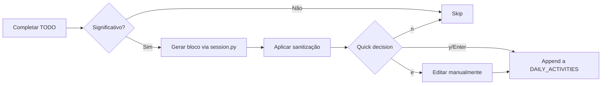

# 📚 Session Documentation Style Guide

**Version**: 1.0.0
**Last Updated**: 2026-03-29
**Status**: Active

---

## 🎯 Objetivo

Este guia define o estilo e as convenções para documentação incremental de sessões de desenvolvimento no Enterprise Default Project Template.

**Por que documentar incrementalmente?**
- ✅ **Reprodutibilidade**: Qualquer pessoa pode reproduzir o trabalho seguindo os passos
- ✅ **Rastreabilidade**: Decisões técnicas documentadas para referência futura
- ✅ **Auditoria**: Histórico completo de mudanças e motivações
- ✅ **Onboarding**: Novos membros entendem o contexto rapidamente
- ✅ **Memória**: Recuperação de contexto em sessões futuras

---

## 📋 Estrutura de Documentos de Sessão

### Arquivos Obrigatórios

Cada sessão deve ter os seguintes arquivos em `docs/SESSIONS/YYYY-MM-DD/`:

| Arquivo | Propósito | Atualização |
|---------|-----------|-------------|
| `SESSION_RECOVERY_YYYY-MM-DD.md` | Contexto recuperado de sessões anteriores | Início da sessão |
| `DAILY_ACTIVITIES_YYYY-MM-DD.md` | Log incremental de atividades | **Durante a sessão** |
| `SESSION_REPORT_YYYY-MM-DD.md` | Relatório técnico detalhado | Fim da sessão |
| `FINAL_STATUS_YYYY-MM-DD.md` | Status final, decisões, próximos passos | Fim da sessão |

---

## 🔤 Formato de Blocos de Atividade

### Template Canônico

```markdown
---

### [Título da Atividade] ([TODO-ID])

**HH:MM — [STATUS]**

**Objetivo**: [O que foi feito]

**Contexto**: [Por que foi necessário]

**Passos executados**:
1. [Passo 1 com ferramenta usada]
2. [Passo 2 com comando executado]
3. [Passo 3 com validação realizada]

**Resultado**: [Outcome — sucesso/bloqueio/aprendizado]

**Decisões técnicas**: [Escolhas feitas, alternativas rejeitadas]

**Arquivos modificados/criados**:
- path/to/file.py (+N/-N)
- path/to/another.md (+N/-N)

**Commits**:
- `abc1234` — tipo(escopo): descrição

**Status**: [✅ Completo | 🔵 Em progresso | ❌ Bloqueado | ⏸️ On hold]

---
```

### Campos Obrigatórios

| Campo | Descrição | Exemplo |
|-------|-----------|---------|
| **Título** | Descrição concisa (50-70 chars) | "IMP-47 Bug Fix — Nested Folder in Upgrade" |
| **Timestamp** | HH:MM no formato 24h | "14:32" |
| **Status** | Um dos 4 status padronizados | "✅ Completo" |
| **Objetivo** | O que foi feito (1-2 frases) | "Corrigir bug de pasta aninhada..." |
| **Contexto** | Por que foi necessário (1-3 frases) | "Bug descoberto na sessão 2026-03-23..." |
| **Passos executados** | Lista numerada de ações | "1. Analisar código\n2. Implementar fix..." |
| **Resultado** | Outcome final (1-2 frases) | "Bug resolvido com 100% de cobertura" |

### Campos Opcionais

| Campo | Quando usar | Exemplo |
|-------|-------------|---------|
| **Decisões técnicas** | Quando há alternativas avaliadas | "Escolhida Opção A ao invés de B por..." |
| **Arquivos modificados** | Quando há mudanças em código | "scripts/lib/project.py (+12/-3)" |
| **Commits** | Quando há commits realizados | "`448e034` — fix: corrigir bug" |
| **TODO-ID** | Quando relacionado a um IMP/TODO | "(IMP-47)" |

---

## ✅ Boas Práticas (DO)

### 1. Documentar Atividades Significativas

✅ **DO**: Documentar atividades que:
- Implementam features ou fixes (>= 10 linhas de código)
- Tomam decisões técnicas importantes
- Criam/modificam documentação estrutural
- Realizam refactorings ou mudanças arquiteturais
- Detectam ou bloqueiam problemas

### 2. Ser Conciso mas Completo

✅ **DO**: 
```markdown
**Objetivo**: Corrigir bug de validação de semver em versões pre-release

**Contexto**: Validador atual rejeitava 1.0.0-alpha.1 como inválido. 
Descoberto durante testes de IMP-35.

**Resultado**: Bug corrigido. Adicionados 5 testes cobrindo pre-release, 
build metadata e edge cases. Todos testes passaram.
```

### 3. Usar Formato Estruturado

✅ **DO**: Seguir template canônico com separadores `---`

✅ **DO**: Manter hierarquia: `### Título` para blocos, `**Campo**:` para metadados

### 4. Registrar Decisões Técnicas

✅ **DO**: 
```markdown
**Decisões técnicas**: Escolhida abordagem A (corrigir em config_from_state)
ao invés de B (validar na CLI) por:
- Resolve o problema na raiz
- Mantém compatibilidade com states existentes
- Permite uso intuitivo de --target-dir
```

### 5. Listar Arquivos Modificados

✅ **DO**: 
```markdown
**Arquivos modificados/criados**:
- scripts/lib/project.py (+12/-3)
- tests/test_smoke_imp47.py (+291/-0)
- docs/BUG_ANALYSIS.md (+45/-0)
```

### 6. Referenciar Commits

✅ **DO**: 
```markdown
**Commits**:
- `448e034` — fix(scaffold): corrigir bug IMP-47 - pasta aninhada em upgrade
- `a1b2c3d` — test(scaffold): adicionar 7 testes para IMP-47
```

---

## ❌ Anti-Padrões (DON'T)

### 1. Não Documentar Trivialidades

❌ **DON'T**: Criar bloco para:
- Correção de typo (< 5 linhas)
- Chores (cleanup, formatting)
- Mudanças cosméticas

### 2. Não Usar Formato Freeform

❌ **DON'T**: 
```markdown
Hoje eu corrigi o bug do scaffold e também atualizei uns docs.
Foi legal because agora funciona melhor.
```

✅ **DO**: Usar template estruturado com campos padronizados

### 3. Não Omitir Contexto

❌ **DON'T**: 
```markdown
**Objetivo**: Corrigir bug

**Contexto**: Bug encontrado

**Resultado**: Corrigido
```

✅ **DO**: Fornecer contexto suficiente:
```markdown
**Objetivo**: Corrigir bug de pasta aninhada em scaffold.py upgrade

**Contexto**: Bug descoberto na sessão 2026-03-23 ao tentar upgrade em 
enterprise-python-analysis. O comando criava /projeto/projeto/ ao invés 
de atualizar /projeto/ in-place.

**Resultado**: Bug resolvido com detecção de override_target == project_name. 
Implementados 7 testes cobrindo todos os cenários.
```

### 4. Não Expor Dados Sensíveis

❌ **DON'T**: 
```markdown
**Passos executados**:
1. Configurar AWS com access_key=AKIA_EXEMPLO_NAO_REAL
2. Deploy em prod-db-01.internal.company.com
3. Testar com user admin@company.com / password123
```

✅ **DO**: Usar placeholders ou omitir:
```markdown
**Passos executados**:
1. Configurar AWS com credenciais do .env
2. Deploy em servidor de produção
3. Testar com usuário de teste autorizado
```

⚠️ **NOTA**: Sistema de sanitização automática aplica redact patterns, 
mas **não confie 100%** — sempre revisar antes de commit.

### 5. Não Usar Timestamps Relativos

❌ **DON'T**: "há 2 horas", "ontem", "mais tarde"

✅ **DO**: "14:32", "2026-03-29"

### 6. Não Misturar Múltiplas Atividades

❌ **DON'T**: 
```markdown
### Várias Coisas (IMP-47, IMP-48, IMP-49)

**Objetivo**: Corrigir bug, criar template e atualizar docs
```

✅ **DO**: Um bloco por atividade significativa

---

## 🎨 Estilo de Escrita

### Tom e Voz

- **Tom**: Profissional, objetivo, técnico
- **Voz**: Ativa, imperativa nos passos ("Analisar", "Implementar", "Validar")
- **Tempo verbal**: Passado no resultado ("Bug resolvido", "Testes adicionados")

### Formatação de Texto

| Elemento | Formato | Exemplo |
|----------|---------|---------|
| Paths de arquivos | `path/to/file.py` | `scripts/lib/project.py` |
| Commits (hash) | `` `abc1234` `` | `` `448e034` `` |
| Comandos | `comando argumentos` | `pytest -v tests/` |
| Nomes de funções | `function_name()` | `config_from_state()` |
| Status | Emoji + texto | ✅ Completo |
| TODO IDs | (IMP-NNN) | (IMP-47) |

### Tamanho de Blocos

| Campo | Guideline |
|-------|-----------|
| Título | 50-70 caracteres |
| Objetivo | 1-2 frases (máx 150 chars) |
| Contexto | 2-4 frases (máx 300 chars) |
| Passos | 3-7 itens (máx 10) |
| Resultado | 1-3 frases (máx 200 chars) |
| Decisões | 2-5 frases (máx 400 chars) |

**Regra geral**: Se um bloco tem > 30 linhas, considerar quebrar em 2+ blocos.

---

## 🔐 Segurança e Sanitização

### Dados a Serem Redactados

**Sempre sanitizar antes de persistir:**

| Tipo | Exemplo | Replacement |
|------|---------|-------------|
| Tokens GitHub | `ghp_abcd1234...` | `[GITHUB_TOKEN_REDACTED]` |
| AWS Keys | `AKIA...` | `[AWS_ACCESS_KEY_REDACTED]` |
| Senhas | `password=secret123` | `password=[PASSWORD_REDACTED]` |
| IPs privados | `192.168.x.x` | `[PRIVATE_IP_REDACTED]` |
| Emails | `user@company.com` | `[EMAIL_REDACTED]` |
| JWT tokens | `eyJ...` | `[JWT_TOKEN_REDACTED]` |

### Processo de Sanitização

1. **Automático**: Função `sanitize_text()` aplica 15+ redact patterns
2. **Manual review**: Sempre revisar output antes de commit
3. **Session-end scan**: `gitleaks` scan obrigatório antes de push

### Security Checklist

Antes de commitar documentação de sessão:

- [ ] Nenhum token/senha em plain text
- [ ] Nenhum IP interno exposto
- [ ] Nenhum email corporativo desnecessário
- [ ] Nenhum endpoint de produção com credenciais
- [ ] Scan com `gitleaks` passou (0 leaks)

---

## 📊 Exemplos Comparativos

### Exemplo 1: Bug Fix

#### ❌ Ruim
```markdown
### Bug corrigido

Tinha um bug no scaffold que eu corrigi. Agora funciona.
```

#### ✅ Bom
```markdown
---

### IMP-47 Bug Fix — Nested Folder in Upgrade (IMP-47)

**10:00 — ✅ Completo**

**Objetivo**: Corrigir bug de pasta aninhada ao executar `scaffold.py upgrade --target-dir /path/to/project`

**Contexto**: Bug descoberto na sessão 2026-03-23. Quando `override_target` aponta para o próprio projeto, `config_from_state()` criava estrutura aninhada incorreta.

**Passos executados**:
1. Analisar `scripts/lib/project.py:config_from_state()`
2. Implementar correção: detectar se `override_target.name == project_name`
3. Criar 7 testes cobrindo mode new, upgrade, edge cases
4. Executar suite: `python -m pytest tests/test_smoke_imp47.py -v`

**Resultado**: Bug resolvido com 100% de cobertura. Todos os 7 testes passaram.

**Decisões técnicas**: Escolhida Opção A (corrigir `config_from_state()`) por resolver na raiz e manter compatibilidade.

**Arquivos modificados/criados**:
- scripts/lib/project.py (+12/-3)
- tests/test_smoke_imp47.py (+291/-0)

**Commits**:
- `448e034` — fix(scaffold): corrigir bug IMP-47 - pasta aninhada em upgrade

**Status**: ✅ Completo

---
```

### Exemplo 2: Research/Análise

#### ❌ Ruim
```markdown
### Pesquisei sobre documentação

Li uns artigos e decidi usar markdown.
```

#### ✅ Bom
```markdown
---

### Research — Documentation System Options (IMP-48 prep)

**09:30 — ✅ Completo**

**Objetivo**: Avaliar opções de implementação para sistema de documentação incremental

**Contexto**: Observada degradação de qualidade documental entre sessões. Necessário definir abordagem antes de implementar IMP-48.

**Passos executados**:
1. Revisar documentação de sessões anteriores (2026-03-23 vs 2026-03-29)
2. Analisar 3 alternativas: auto-append, semi-auto (prompt), manual com reminder
3. Invocar Template Architect agent para análise multi-perspectiva
4. Avaliar scores: Architecture (9/10), DevEx (9/10), Security (8/10)

**Resultado**: Aprovada Alternativa 1 (hybrid auto-append) com ROI 3.5x. Criados 4 IMPs (48-51) com cronograma de 3 sessões.

**Decisões técnicas**: 
- Implementação faseada (fundação → integração → docs → busca)
- IMP-51 (Busca MCP) priorizado por atender objetivo B do usuário
- Controles de segurança (gitleaks) obrigatórios

**Arquivos modificados/criados**:
- docs/SESSIONS/2026-03-29/DEBATE_INCREMENTAL_DOCUMENTATION_2026-03-29.md (+1050/-0)
- docs/TODO.md (+4 IMPs)

**Status**: ✅ Completo

---
```

---

## 🔄 Workflow de Documentação

### Durante a Sessão



### No Fim da Sessão

1. **Review**: Ler `DAILY_ACTIVITIES` completo
2. **Validate**: Executar `make session-validate`
3. **Sanitize**: Executar `make session-sanitize`
4. **Security scan**: Executar `gitleaks` em `docs/SESSIONS/`
5. **Commit**: Se scan passou, commitar documentação
6. **Atualizar**: Atualizar `FINAL_STATUS` com resumo

---

## 🛠️ Ferramentas Disponíveis

### Scripts

| Script | Uso |
|--------|-----|
| `scripts/lib/session.py` | Módulo para gerar/validar blocos |
| `scripts/session-validate.py` | Validar formato de DAILY_ACTIVITIES |
| `scripts/session-sanitize.py` | Aplicar redact patterns em docs |
| `scripts/migrate-daily-activities.py` | Migrar freeform → structured |

### Makefile Targets

| Target | Descrição |
|--------|-----------|
| `make session-log` | Tail -f do DAILY_ACTIVITIES atual |
| `make session-validate` | Validar formato da sessão |
| `make session-sanitize` | Sanitizar docs da sessão |

### Uso Programático

```python
from scripts.lib.session import (
    ActivityBlock,
    ActivityStatus,
    generate_activity_block,
    append_to_daily_activities,
)
from pathlib import Path

# Criar bloco
block = generate_activity_block(
    title="IMP-47 Bug Fix",
    todo_id="IMP-47",
    objective="Corrigir bug de pasta aninhada",
    context="Bug descoberto na sessão anterior",
    steps=[
        "Analisar código",
        "Implementar fix",
        "Criar testes"
    ],
    result="Bug resolvido com 100% de cobertura",
    status=ActivityStatus.COMPLETE,
    files_modified=["scripts/lib/project.py (+12/-3)"],
    commits=["448e034 — fix: corrigir bug"],
)

# Adicionar a DAILY_ACTIVITIES
session_dir = Path("docs/SESSIONS/2026-03-29")
success = append_to_daily_activities(block, session_dir, sanitize=True)
```

---

## 📚 Referências

- **Template canônico**: `docs/templates/DAILY_ACTIVITIES.template.md`
- **Debate original**: `docs/SESSIONS/2026-03-29/DEBATE_INCREMENTAL_DOCUMENTATION_2026-03-29.md`
- **TODO tracking**: `docs/TODO.md` → IMPs 48-51
- **Security guide**: `docs/SECURITY_SESSION_DOCS.md` (a ser criado em IMP-49)

---

## 📝 Changelog

### v1.0.0 — 2026-03-29
- ✨ Versão inicial do style guide
- ✅ Template canônico definido
- ✅ Boas práticas e anti-padrões documentados
- ✅ Exemplos comparativos incluídos
- ✅ Security checklist adicionado

---

*Style Guide criado como parte de IMP-48 (Fundação Session Docs) — 2026-03-29*
